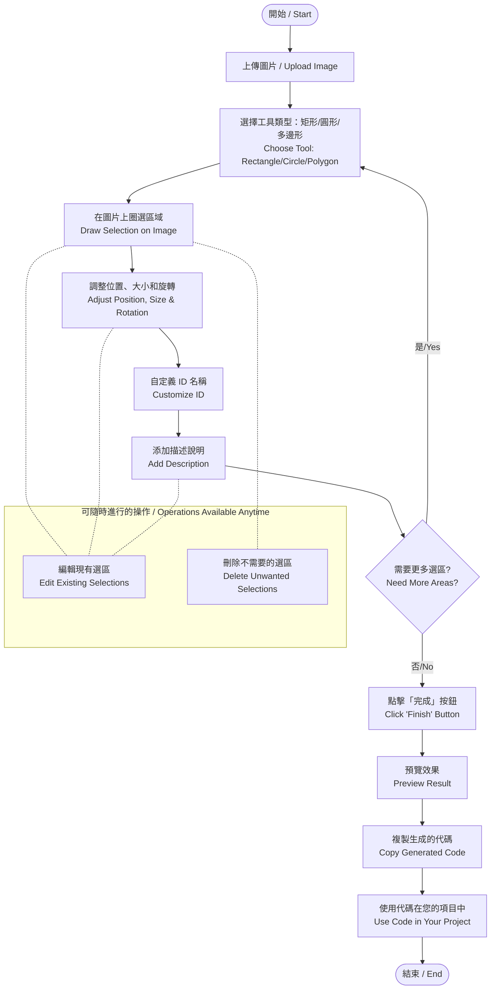

# ImgEleTor - 圖片元素選取工具 | Image Element Selector Tool

## 📝 專案簡介 | Project Overview

ImgEleTor 是一個直覺且強大的網頁工具，允許您上傳圖片並輕鬆圈選元素，生成相應的 HTML 代碼。特別適合前端開發者快速實現圖片熱區與互動元素的標記。

ImgEleTor is an intuitive and powerful web tool that allows you to upload images and easily select elements to generate corresponding HTML code. It is especially suitable for front-end developers to quickly implement image hotspots and interactive element markup.

## ✨ 功能特點 | Features

- 🖼️ 支援各種圖片格式上傳 | Support for various image formats
- 🔍 矩形、圓形與多邊形選取工具 | Rectangle, circle and polygon selection tools
- 📏 直覺的拖拽與調整大小功能 | Intuitive drag and resize functionality
- 🔄 元素旋轉控制，支援鍵盤微調 | Element rotation control with keyboard fine-tuning
- 🏷️ 自定義每個選區的 ID 名稱 | Customize ID names for each selection
- 📝 為選區添加說明文字 | Add descriptive text to selections for better management
- 👁️ 即時預覽效果 | Real-time preview of the result
- 📋 一鍵複製生成的 HTML 代碼 | One-click copy of generated HTML code
- 📱 響應式設計，適配不同螢幕尺寸 | Responsive design for various screen sizes

## 🔄 操作流程圖 | Operation Flowchart



## 🚀 使用方法 | How to Use

### 1. 上傳圖片 | Upload Image
- 點擊「選擇圖片」按鈕上傳您想要標記的圖片
- Click the "Choose Image" button to upload the image you want to mark

### 2. 選取區域 | Select Areas
- 選擇形狀類型（矩形、圓形或多邊形）
- 在圖片上按住滑鼠左鍵並拖動創建矩形或圓形選區
- 多邊形模式下，點擊添加頂點，接近起始點可閉合多邊形
- 可以拖動選區調整位置
- 使用四角的控制點調整選區大小
- 使用旋轉控制點或鍵盤箭頭鍵調整旋轉角度

---

- Choose the shape type (rectangle, circle or polygon)
- Hold the left mouse button and drag on the image to create rectangle or circle selections
- In polygon mode, click to add vertices, approach the starting point to close the polygon
- Drag the selection to adjust its position
- Use the corner control points to resize the selection
- Use rotation control point or keyboard arrow keys to adjust rotation angle

### 3. 元素旋轉控制 | Rotation Control
- 選中矩形元素時會顯示旋轉控制點
- 使用旋轉按鈕進行快速角度調整（-90°, -45°, -15°, -1°, 0°, +1°, +15°, +45°, +90°）
- 鍵盤快捷鍵：
  - 方向鍵：微調旋轉 ±1°
  - Shift + 方向鍵：中等調整 ±15°
  - Ctrl + 方向鍵：大幅調整 ±45°

---

- Rotation control point appears when a rectangle element is selected
- Use rotation buttons for quick angle adjustments (-90°, -45°, -15°, -1°, 0°, +1°, +15°, +45°, +90°)
- Keyboard shortcuts:
  - Arrow keys: Fine-tune rotation by ±1°
  - Shift + Arrow keys: Medium adjustment by ±15°
  - Ctrl + Arrow keys: Large adjustment by ±45°

### 4. 多邊形選取 | Polygon Selection
- 選擇多邊形工具後，在圖片上點擊添加頂點
- 至少需要3個點才能形成有效多邊形
- 接近起始點時，會有高亮提示可閉合多邊形
- 達到50個點時會詢問是否自動閉合
- 完成的多邊形可以像其他選區一樣調整位置和大小

---

- After selecting the polygon tool, click on the image to add vertices
- At least 3 points are required to form a valid polygon
- When approaching the starting point, a highlight prompt will appear to close the polygon
- At 50 points, you'll be asked if you want to automatically close the polygon
- Completed polygons can be repositioned and resized like other selections

### 5. 自定義選區 | Customize Selections
- 在右側列表中可以查看所有已創建的選區
- 點擊「編輯ID」可自定義選區的 ID 名稱（默認為 selection-1、selection-2 等）
- 點擊「編輯說明」可為選區添加描述性文字，方便日後維護
- 點擊「刪除」可移除不需要的選區

---

- View all created selections in the right-side list
- Click "Edit ID" to customize the ID name (default is selection-1, selection-2, etc.)
- Click "Edit Description" to add descriptive text for future maintenance
- Click "Delete" to remove unwanted selections

### 6. 生成與使用代碼 | Generate and Use Code
- 點擊「完成」按鈕生成代碼並自動滾動到預覽區
- 「複製選區代碼」按鈕複製純選區 HTML
- 「複製完整代碼」按鈕複製帶圖片的完整 HTML 結構

---

- Click the "Finish" button to generate code and automatically scroll to the preview area
- "Copy Selection Code" button copies HTML for selections only
- "Copy Full Code" button copies complete HTML structure with the image

## 📋 生成的代碼示例 | Generated Code Examples

```html
<!-- 僅選區代碼 | Selections code only -->
<div id="header" style="left: 10.25%; top: 5.75%; width: 80.50%; height: 15.20%;" data-description="網站頭部區域"></div>
<div id="logo" style="left: 2.30%; top: 6.42%; width: 10.75%; height: 10.75%;" class="absolute rounded-full"></div>
<div id="custom-shape" style="left: 20.30%; top: 40.42%; width: 30.75%; height: 20.75%; clip-path: polygon(0% 0%, 100% 0%, 50% 100%);" data-description="自定義多邊形區域"></div>

<!-- 完整代碼 | Complete code -->
<div class="relative">
  
  <div class="absolute top-0 left-0 w-full h-full">
    <div id="header" style="left: 10.25%; top: 5.75%; width: 80.50%; height: 15.20%;" data-description="網站頭部區域"></div>
    <div id="logo" style="left: 2.30%; top: 6.42%; width: 10.75%; height: 10.75%;" class="absolute rounded-full"></div>
    <div id="custom-shape" style="left: 20.30%; top: 40.42%; width: 30.75%; height: 20.75%; clip-path: polygon(0% 0%, 100% 0%, 50% 100%);" data-description="自定義多邊形區域"></div>
  </div>
</div>
```

## ⚙️ 技術細節 | Technical Details

- 純前端實現，無需後端支持 | Pure front-end implementation, no backend required
- 使用 HTML5、CSS3 和原生 JavaScript | Using HTML5, CSS3, and native JavaScript
- 採用百分比定位，確保選區在不同螢幕尺寸下的正確顯示 | Percentage-based positioning ensures proper display on different screen sizes
- 支援通過 data-description 屬性保存元素說明 | Support for saving element descriptions via data-description attributes
- 使用CSS clip-path實現多邊形選區 | Using CSS clip-path to implement polygon selections
- 使用CSS transform實現元素旋轉 | Using CSS transform for element rotation

## 🎯 使用場景 | Use Cases

- 創建圖片地圖（image maps）| Creating image maps
- 設計網頁原型中的可點擊區域 | Designing clickable areas in web prototypes
- 標記圖片中的產品或重點元素 | Marking products or key elements in images
- 電子商務網站上的產品細節展示 | Product detail displays on e-commerce websites
- 互動式圖像教學與導覽 | Interactive image tutorials and guides
- 創建不規則形狀的熱區 | Creating irregular shaped hotspots
- 開發高度自定義的圖片互動內容 | Developing highly customized image interactive content

## 👨‍💻 開發者說明 | Developer Notes

若要在您的項目中整合 ImgEleTor，只需引入主要的 CSS 和 JavaScript 文件：

To integrate ImgEleTor into your project, simply include the main CSS and JavaScript files:

```html
<link rel="stylesheet" href="main.css">
<script src="main.js"></script>
```

HTML 結構參考 | HTML structure reference:

```html
<div id="imageContainer" class="relative">
  
  <div id="placeholderText">請上傳圖片 | Please upload an image</div>
  <div id="selectionsContainer"></div>
</div>
``` 